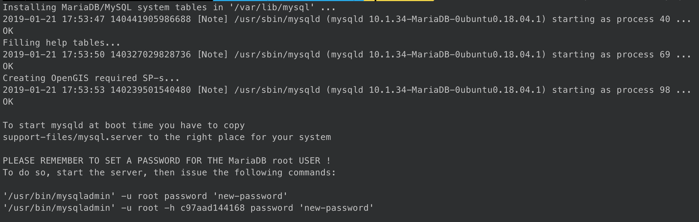
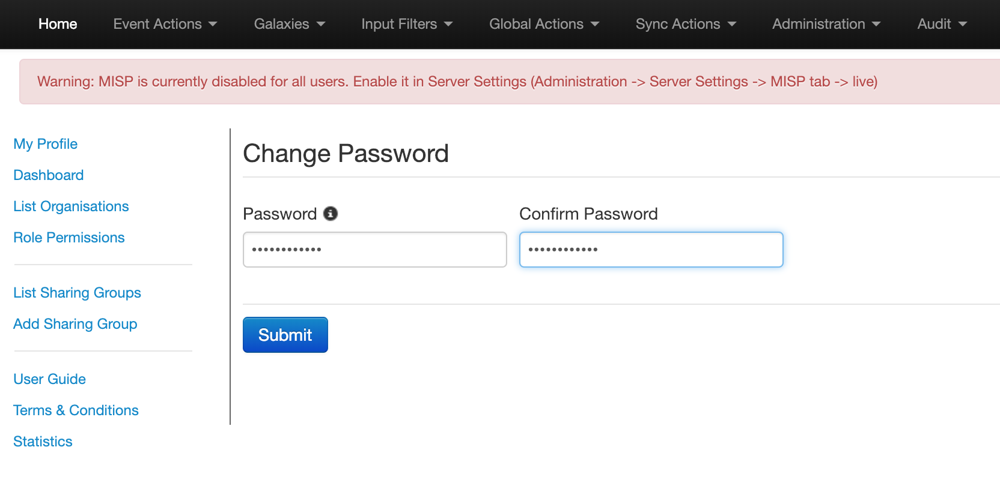

# Docker MISP Container

This is an easy and highly customizable Docker container with MISP -
[Malware Information Sharing Platform & Threat Sharing](http://www.misp-project.org)

Our goal was to provide a way to setup + run MISP in less than a minute!

We follow the official MISP installation steps everywhere possible,
while adding automation around tedious manual steps and configurations.

We have done this without sacrificing options and the ability to
customize MISP for your unique environment! Some examples include:
auto changing the salt hash, auto initializing the database, auto generating GPG
keys, auto generating working + secure configs, and adding custom
passwords/domain names/email addresses/ssl certificates.

The misp-modules extensions functionality has been included and can be
accessed from `http://<FQDN of MISP>:6666/modules`. (thanks to Conrad)

## Latest Update: 1-15-2019

Following the Official MISP Ubuntu 18.04 LTS build instructions.

Latest Upstream Change Included: `a62bca4e169c919413bba4e6ce978e30aae9183e`

### Generate OpenSSL cert

```bash
openssl req -newkey rsa:4096 \
    -nodes -x509 -days 3650 \
    -subj "/C=US \
    /ST=New York \
    /L=Brooklyn \
    /O=Example Brooklyn Company \
    /CN=examplebrooklyn.com" \
    -keyout container/certs/misp.key \
    -out container/certs/misp.crt
```

### Building MISP Docker image

1. `git clone https://github.com/harvard-itsecurity/docker-misp.git`
1. `cd docker-misp`
1. Run the following command to build the Docker image
    1. This build process can take up to 20mins

```bash
mysql_pass=$(openssl rand -hex 32)

docker build \
    --build-arg MYSQL_MISP_PASSWORD=$mysql_pass\
    --build-arg POSTFIX_RELAY_HOST=<FQDN to SMTP relay>\
    --build-arg MISP_FQDN=<FQDN to MISP>\
    --build-arg MISP_EMAIL=admin@admin.test\
    -t misp container

echo "MySQL password"
echo $mysql_pass
```

### Initialize MISP database

1. `docker volume create misp-db`
1. `docker run -it --rm -v misp-db:/var/lib/mysql misp /init-db`
1. 

### Deploy stack

1. Start stack locally: `docker-compose up -d`
1. Deploy stack to swarm: `docker stack deploy --compose-file docker-compose-swarm.yml mispstack`

## Access Web URL

1. Browse to `https://<FQDN for MISP>`
    1. Username: `admin@admin.test`
    1. Password: `admin`
1. change the password! :)
1. 

## Contributions

* Conrad Crampton: @radder5 - RNG Tools and MISP Modules

* Jeremy Barlow: @jbarlow-mcafee - Cleanup, configs, conveniences, python 2 vs 3 compatibility

* Matt Saunders: @matt-saunders - Fixed all install warnings and errors

## Help/Questions/Comments

For help or more info, feel free to contact Ventz Petkov: ventz_petkov@harvard.edu

## Resources/Sources

* [OpenSSL Essentials: Working with SSL Certificates, Private Keys and CSRs](https://www.digitalocean.com/community/tutorials/openssl-essentials-working-with-ssl-certificates-private-keys-and-csrs)
* [MISP Install Documentation](https://misp.github.io/MISP/INSTALL.ubuntu1804/)
* [Github - MISP](https://github.com/MISP/MISP)